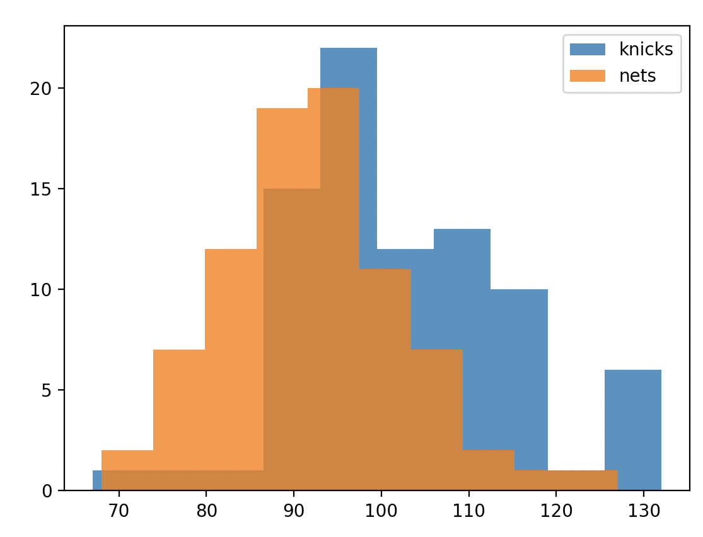
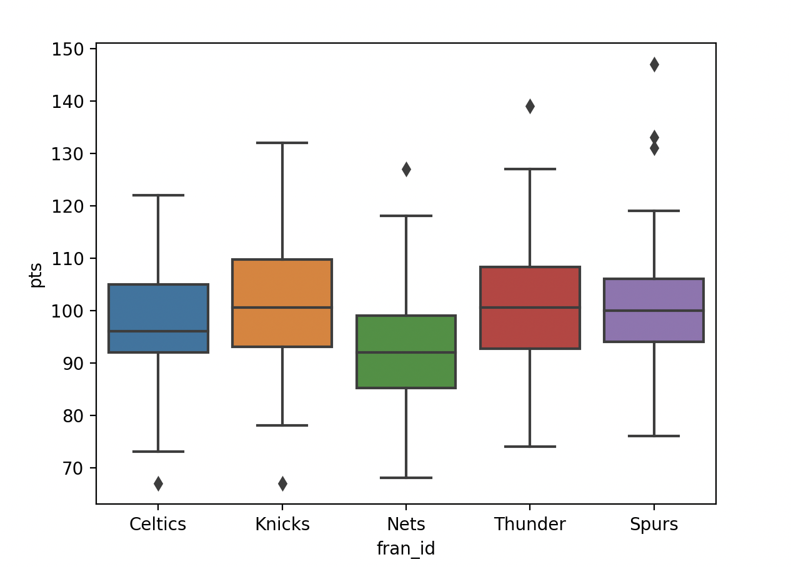
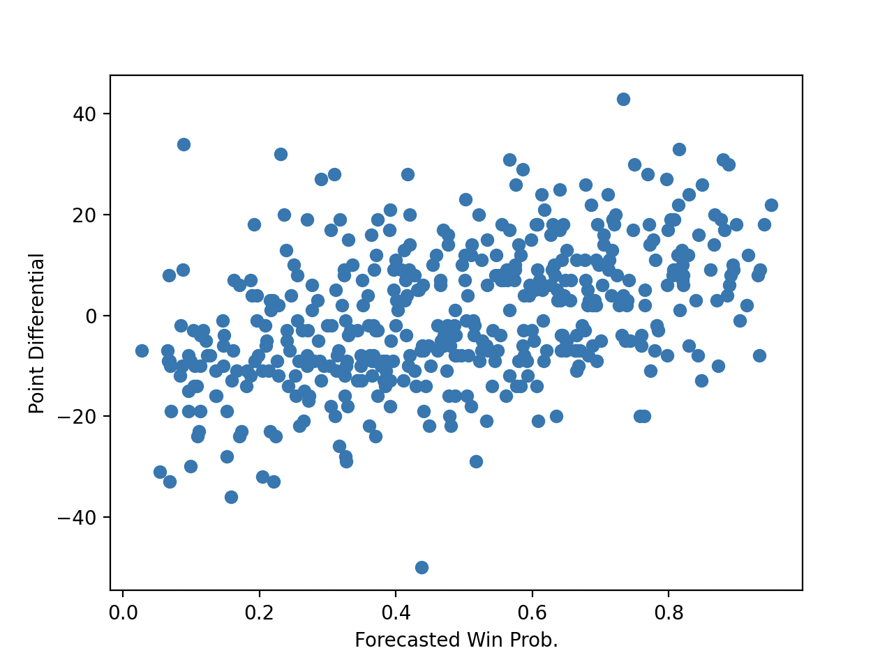

# NBA Games Analysis

This is a Python script that analyzes NBA games using data visualization techniques and statistical methods.

## Requirements

* matplotlib
* numpy
* pandas
* seaborn
* scipy

## Usage

1. Clone this repository

```
$ git clone https://github.com/BadassBoom/nba-games-analysis.git
```
2. Move to the directory of the cloned repository

```
$ cd nba-games-analysis
```
3. Run the script

```
$ python nba_analysis.py
```

The script will generate several visualizations and statistical analyses for NBA games. The data used for the analysis is in the **'nba_games.csv'** file.

## Examples

### Difference in mean scores between Knicks and Nets in 2010 and 2014

The script calculates the difference in mean scores between Knicks and Nets in 2010 and 2014, and plots a histogram for each year.



### Box plot for Knicks and Nets in 2010

The script generates a box plot showing the distribution of scores for Knicks and Nets in 2010.


### Crosstab of game result and game location for 2010

The script generates a crosstab of game result and game location for 2010, and performs a chi-squared test to determine if there is a relationship between these two variables.



### Scatter plot of forecasted win probability and point differential for 2010

The script generates a scatter plot of forecasted win probability and point differential for 2010, and calculates the covariance and correlation between these two variables.



## Credit 

The data used for the analysis is from [Basketball Reference](https://www.basketball-reference.com/).
